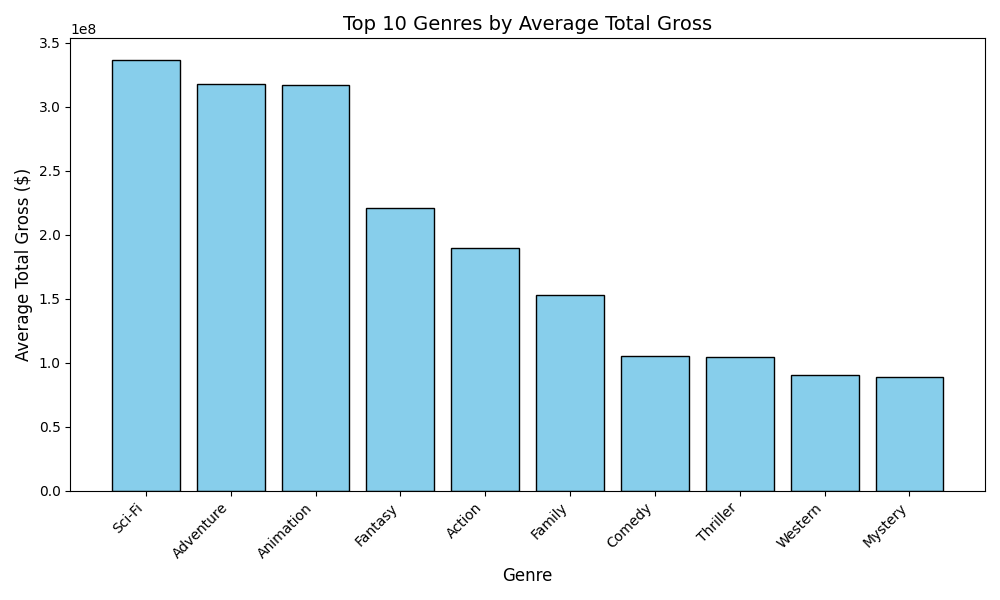
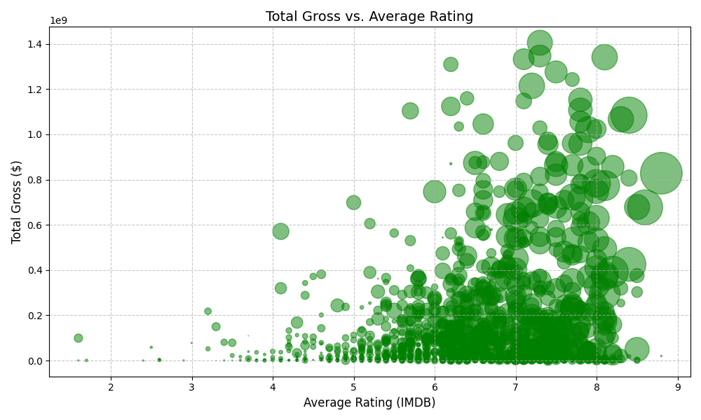
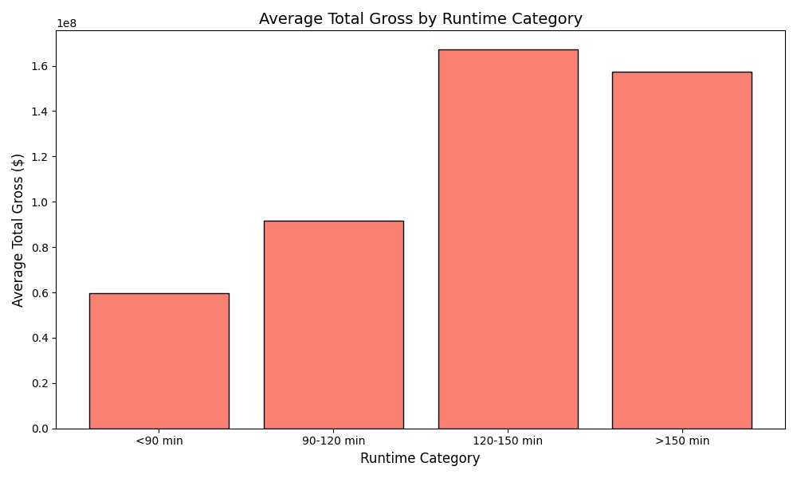

# Movie Studio Analysis

## Overview
This project analyzes movie data to guide a new movie studio in producing films that maximize box office revenue. By examining historical data on movie genres, audience ratings, and runtimes, we identify key trends and provide actionable recommendations to inform production decisions. The analysis uses Python and Pandas (a tool for organizing and analyzing data) for data processing and visualization, with findings presented in a Jupyter Notebook (`movie_analysis.ipynb`) and a slide deck (`presentation.pdf`).

## Business Understanding
**Stakeholder**: A new movie studio aiming to produce commercially successful films.  
**Business Problem**: The studio needs to understand which film characteristics drive high box office revenue to prioritize production and marketing efforts.  
**Key Business Questions**:
- Which movie genres generate the highest revenue?
- Do higher audience ratings correlate with better box office performance?
- What film runtimes are associated with the highest ticket sales?

These insights will help the studio make data-driven decisions to compete in the competitive film industry.

## Data Understanding and Analysis

### Source of Data
- **Box Office Mojo**: Provides financial data, including domestic and foreign gross revenue, for approximately 3,387 movies from 2010–2018.
- **IMDB**: Supplies movie characteristics, such as genres, average audience ratings, and runtime, for approximately 146,144 movies, filtered to include only those with reliable ratings (more than 100 votes).
- **Merged Dataset**: Combines both sources, resulting in 1,000–2,000 movies with complete financial and characteristic data after cleaning.

### Description of Data
The merged dataset (`merged_df`) includes:
- **Columns**: `title`, `domestic_gross`, `foreign_gross`, `total_gross`, `genres`, `average_rating`, `runtime_minutes`, `year`.
- **Data Cleaning**: Missing values were filled (e.g., `genres` with "Unknown", `domestic_gross` with median), titles were standardized for merging, duplicates were removed, and data types were corrected (e.g., `foreign_gross` to float64).
- **Analysis Tools**: Python with Pandas for data manipulation, Matplotlib for creating visualizations, and SQLite for querying IMDB data.

### Visualizations
The following visualizations support the recommendations and are included in the Jupyter Notebook (`movie_analysis.ipynb`) and slide deck (`presentation.pdf`). They are displayed below to illustrate key findings:

1. **Bar Plot of Average Total Gross by Genre**  
   - **Description**: This bar plot shows the average box office revenue (`total_gross`) for each movie genre. Adventure, Action, and Sci-Fi genres stand out, consistently earning over $200 million on average, indicating their strong appeal to audiences.  
   - **Visualization**:  
       
   - **Insight**: Producing films in Adventure, Action, and Sci-Fi genres can maximize ticket sales due to their proven commercial success.

2. **Scatter Plot of Total Gross vs. Average Rating**  
   - **Description**: This scatter plot displays `total_gross` against `average_rating` from IMDB, showing a weak correlation (~0.2) between audience ratings and revenue. Many high-grossing films have moderate ratings (6–8), suggesting that critical acclaim is not the primary driver of financial success.  
   - **Visualization**:  
       
   - **Insight**: Strong marketing campaigns are more critical than high ratings for driving box office performance.

3. **Bar Plot of Average Total Gross by Runtime Category**  
   - **Description**: This bar plot shows average `total_gross` for movies grouped into runtime categories. Films with runtimes of 120–150 minutes have the highest average revenue (~$167.2 million), aligning with popular blockbuster epics.  
   - **Data**: The table below summarizes the average total gross by runtime category (from the notebook):  

     | Runtime Category | Average Total Gross ($) |
     |------------------|------------------------:|
     | <90 min         | 59,763,810             |
     | 90–120 min      | 91,816,930             |
     | 120–150 min     | 167,203,800            |
     | >150 min        | 157,556,100            |

   - **Visualization**:  
       
   - **Insight**: Targeting a runtime of 120–150 minutes balances engaging storytelling with audience preferences for high-grossing films.

## Conclusion
The analysis provides three key findings to guide the studio’s production strategy:
1. **Focus on High-Grossing Genres**: Adventure, Action, and Sci-Fi films consistently generate the highest box office revenue, often exceeding $200 million per film. Producing films in these genres can attract large audiences and boost ticket sales.
2. **Prioritize Marketing Over Ratings**: Audience ratings have a weak correlation with revenue, indicating that strong marketing campaigns are more effective than relying on critical acclaim to drive opening weekend performance.
3. **Target 120–150 Minute Runtimes**: Films with runtimes of 120–150 minutes achieve the highest average revenue, suggesting this length is ideal for creating engaging, commercially successful films.

These data-driven recommendations—focusing on popular genres, investing in marketing, and optimizing runtime—offer a strategic roadmap for the studio to produce commercially successful films. Future analysis could explore production budgets or audience demographics to further refine these strategies.
